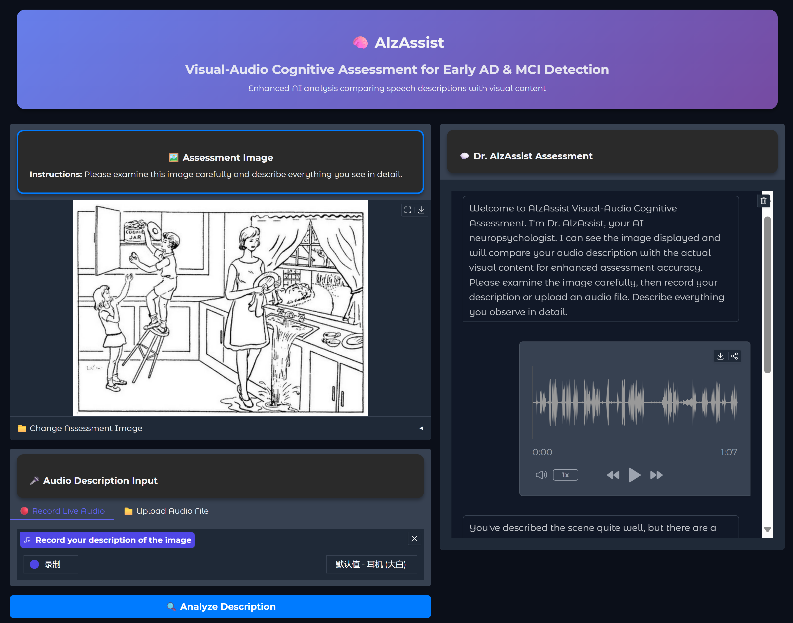

# 🧠 AlzAssist

<div align="center">



*An LLM-powered assistant for Alzheimer's disease early automatic screening*

---

</div>

## 🚀 Quick Start

### Environment Setup

To use our online GUI program, please first create a conda environment and install all necessary dependencies:

```bash
# Create and activate conda environment
conda create -y -n alzassist python==3.10.18 pip
conda activate alzassist

# Install core dependencies
pip install gradio==5.23.1 gradio_client==1.8.0 ffmpeg==1.4 ffmpeg-python==0.2.0

# Install PyTorch with CUDA support
pip install torch==2.7.1+cu128 torchvision==0.22.1 torchaudio==2.7.1 --index-url https://download.pytorch.org/whl/cu128

# Install additional packages
pip install 'ms-swift[all]==3.5.3' -U
pip install "soundfile" "qwen_omni_utils" -U
pip install ninja==1.11.1.4 packaging==25.0

# Install flash attention (may take some time)
MAX_JOBS=8 pip install flash-attn==2.8.0.post2 --no-build-isolation 
```

## ⚠️ System Requirements

> **Hardware Requirements:**
> - NVIDIA graphics card with **VRAM > 48GB**
> - Support for **bfloat16** precision
> - CUDA 12.8 compatible drivers

## 🔮 Zero-Shot Inference (Inference using custom prompts without training)

### Step 1: Download Pre-trained Model

```bash
modelscope download --model Qwen/Qwen2.5-Omni-7B --local_dir path/to/ckpt
```

### Step 2: Launch GUI Backend

```bash
CUDA_VISIBLE_DEVICES=0 python web_demo_valm.py --flash-attn2 --server-name 0.0.0.0 -c path/to/ckpt
```

### Step 3: Access Web Interface

1. Open your browser and navigate to the provided HTTPS URL
2. ⚠️ **Important:** Use **HTTPS** protocol for hardware access (microphone, etc.)
3. You may see a privacy warning due to the locally signed SSL certificate - simply proceed

## 🎯 RLHF Training

### Prerequisites

- **4x NVIDIA GPUs** with **≥48GB VRAM each**

### Dataset Preparation

1. Download the **PREPARE Phase 1** training and testing audio datasets
2. Extract all files
3. Place all **MP3 audio files** in the `official_dataset/` folder

### Training Process

#### Step 1: Configure Training Script

Modify the `--model` parameter in `dapo_launch.sh` to point to your pre-trained weights:

```bash
# Edit dapo_launch.sh
--model path/to/ckpt
```

#### Step 2: Start Training

```bash
bash dapo_launch.sh
```

#### Step 3: Merge LoRA Weights

After training completion, fuse the LoRA checkpoint with the main weights:

```bash
swift export \
    --model path/to/ckpt \
    --adapters checkpoint-1800 \  # Use your final checkpoint
    --merge_lora true
```

#### Step 4: Run Inference with Trained Model

Specify the fused weights in the GUI backend parameters to use your trained model.

### We plan to release a trained weights for direct access to optimal inference results. This is expected to take a few more days, please stay tuned.

---

<div align="center">

## 📚 Acknowledgments

This project builds upon the excellent work from [**Qwen2.5-Omni**](https://github.com/QwenLM/Qwen2.5-Omni). Much of the core code is derived from their implementation.

---

*Made with ❤️ for the Alzheimer's research community*

</div>